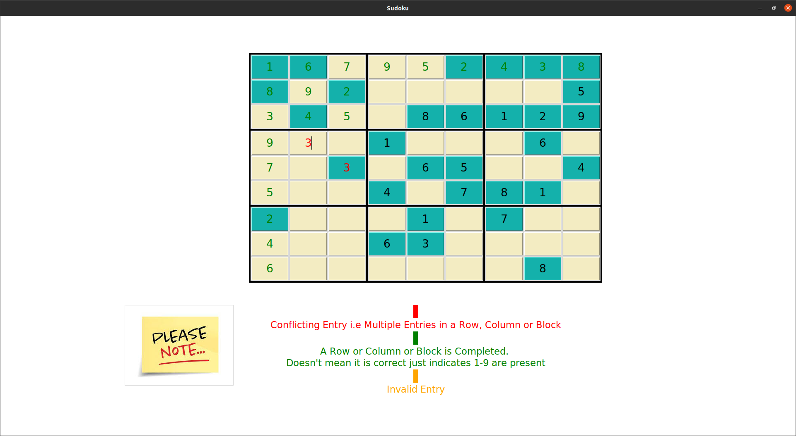

# sudoku

An interactive and multithreaded version to simulate the SUDOKU game. Support user friendly options for input and highlighting the wrong entries.

The sudoku board was build and solved using backtracking algorithm.
Gui is made using Python Tkinter

